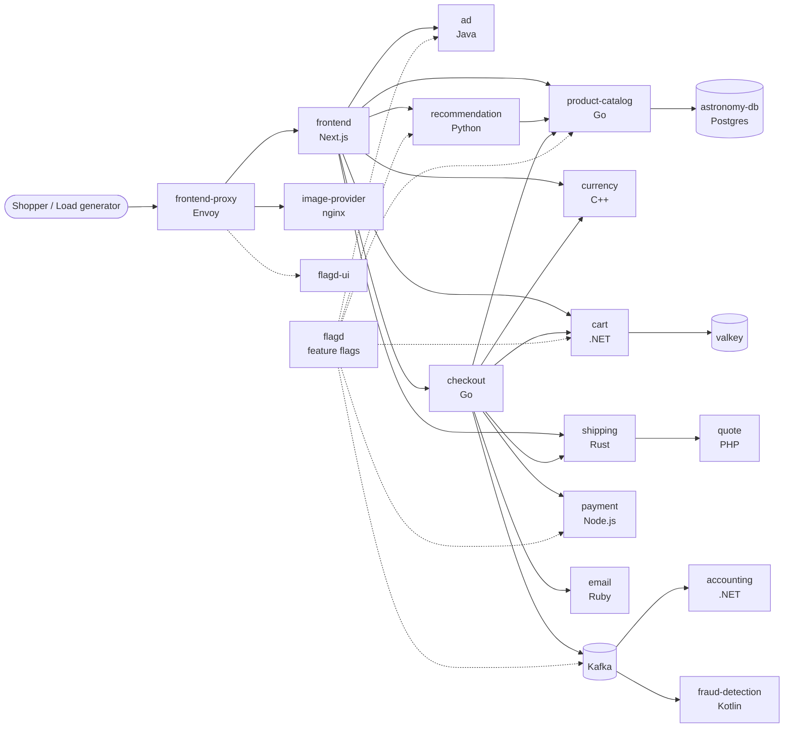

# Architecture: What We're Running

## The app from a user's view

The Astronomy Shop is an online store that sells telescopes and astronomy gear.

| Page | What you see | What happens behind it |
|---|---|---|
| **Home** | Grid of products, currency selector | `product-catalog`, `currency`, `ad` |
| **Product page** | Photo, price, "You may also like", an ad banner | `product-catalog`, `recommendation`, `ad`, `image-provider` |
| **Cart** | Items, quantities, shipping estimate | `cart` (backed by Valkey/Redis), `shipping` → `quote` |
| **Checkout** | Pre-filled address and fake credit card, "Place Order" | `checkout` calls `cart`, `product-catalog`, `currency`, `shipping`, `payment`, `email`, then publishes to **Kafka** |
| **Order confirmation** | Order ID, tracking ID | `accounting` and `fraud-detection` consume the Kafka event asynchronously |

A **load generator** (Locust) plays the part of real shoppers around the clock, so the dashboards
always have traffic, even when you aren't clicking around.

## Service map



Verified on chart **0.42.0 / demo 3.1.0** (Phase 0): `product-catalog` reads from **astronomy-db**
(Postgres), and there are also `opamp-server` (collector management) and `telemetry-docs`. The AI
components (`agent`, `chatbot`, `mcp`) are **turned off** in this lab because they need an external LLM
(see [phase-0 ISSUE-3](labs/phase-0-foundation.md#issues-log)). Run `make status` to see what's
deployed.

**Measured checkout critical path** (from a real trace, ~47 ms): checkout → cart (valkey) →
product-catalog (astronomy-db) ×N → currency ×N → shipping → quote → payment → shipping (ship) →
cart (empty, flagd) → email → Kafka publish. Walkthrough in [phase-0 Step 6](labs/phase-0-foundation.md#step-6-trace-one-checkout-from-end-to-end-the-exit-criterion).

## Where each SRE concept lands in the architecture

| Concept | Where it lives |
|---|---|
| SLIs (edge) | `frontend-proxy` (Envoy) and spanmetrics for `checkout`, `product-catalog`, `cart` |
| Synchronous critical path | proxy → frontend → checkout → payment/cart/shipping/currency |
| Async path (freshness SLI) | checkout → Kafka → accounting / fraud-detection |
| Failure injection | `flagd` feature flags |
| State | `valkey` (cart) and Kafka. These are the parts where losing data is possible |
| Traffic | `load-generator`, which can be scaled up for capacity tests |

## Lab platform layers

```
┌───────────────────────────────────────────────────────────────┐
│ Phase 7   Argo CD (GitOps) · Argo Rollouts (canary)           │
├───────────────────────────────────────────────────────────────┤
│ Phase 5   Chaos Mesh (pod / network / stress faults)          │
├───────────────────────────────────────────────────────────────┤
│ Phase 2-3 Observability: OTel Collector → Prometheus · Tempo  │
│           · Loki → Grafana; Alertmanager → PagerDuty + Slack  │
│           Sloth → SLO recording rules + burn-rate alerts      │
├───────────────────────────────────────────────────────────────┤
│ Phase 0   Astronomy Shop (namespace: astronomy-shop)          │
├───────────────────────────────────────────────────────────────┤
│           Kubernetes: kind (local) → EKS (+AKS opt.) (Ph. 8)  │
└───────────────────────────────────────────────────────────────┘
```
