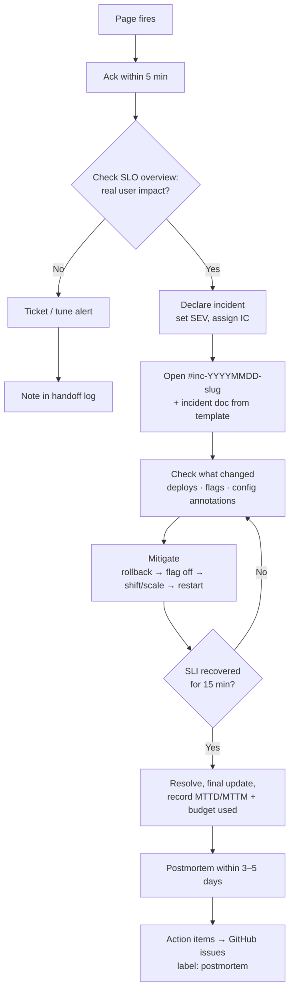

# Incident Response Plan: Astronomy Shop

This is the operational plan: who does what, when, and with which tools. The concepts behind it
are in [principles/04](principles/04-incident-management.md) and [principles/05](principles/05-postmortems.md).

## 1. On-call

| Item | Lab setup | Real-world equivalent |
|---|---|---|
| Rotation | You are primary. If you practice with friends, rotate weekly, with the others as secondary and as game master | A weekly primary + secondary rotation of 6–8 engineers |
| Paging | Alertmanager → **PagerDuty free** (phone push, acknowledge, escalation) → mirrored to Slack `#pages` ([ADR-0003](adr/0003-paging-and-incident-tooling.md)) | PagerDuty / incident.io |
| Acknowledge within | **5 min** (page) | 5 min |
| Escalation | PagerDuty escalation policy: not acknowledged in 10 min → secondary; SEV1 not mitigated in 30 min → "engineering manager" (the game master) | Automated escalation policy |
| Handoff | Notes in `oncall/handoff-log.md` at the end of each session | Handoff at shift change |

## 2. Severity matrix (tied to SLOs)

| Sev | Criteria (any one is enough) | IC required | Updates | Postmortem |
|---|---|---|---|---|
| **SEV1** | Checkout availability < 90%, **or** the shop is down (synthetic probe failing), **or** burn rate > 50x | Yes | Every 15 min | Required within 3 days |
| **SEV2** | A fast-burn **page** fired on any CUJ, **or** checkout p99 > 3s | Yes | Every 30 min | Required within 5 days |
| **SEV3** | A slow-burn **ticket** fired, Kafka lag growing, no user impact yet | No, on-call handles it | When it changes | Optional |

When unsure, pick the higher severity. You can downgrade later.

## 3. Response workflow



## 4. Communications

| Channel | Purpose |
|---|---|
| `#pages` | Alerts only, with no discussion |
| `#inc-YYYYMMDD-<slug>` | One per incident: the working channel and the timeline |
| `#status` | Stakeholder updates using the template in [principles/04](principles/04-incident-management.md#status-update-template) |
| Incident doc | `incidents/YYYY-MM-DD-<slug>.md`: live timeline, which becomes the start of the postmortem |

## 5. Runbook index (built in Phase 3)

| Alert | Runbook | First mitigation to try |
|---|---|---|
| `CheckoutAvailability` (page) | `runbooks/checkout-availability.md` | Check payment/cart errors in RED → roll back the last change or turn off the flag |
| `CheckoutLatency` (page) | `runbooks/checkout-latency.md` | Find the slow hop in a trace → scale it or roll back |
| `BrowseAvailability` (page) | `runbooks/browse-availability.md` | product-catalog / frontend errors → roll back |
| `BrowseLatency` (page) | `runbooks/browse-latency.md` | ad / recommendation saturation → scale, or degrade gracefully |
| `ShopDown` (page) | `runbooks/shop-down.md` | frontend-proxy / nodes / cluster health |
| `KafkaConsumerLag` (ticket) | `runbooks/kafka-lag.md` | Check the accounting consumer, restart or scale it |

Every runbook follows [the template](templates/runbook.md) and gets updated after each incident that used it.

## 6. Game-day program (Phase 4 onward)

| Week | Scenario | Trigger | Primary skill practiced |
|---|---|---|---|
| 1 | Payment failures | `paymentFailure` flag at 10% → 50% | Detecting with SLO alerts; mitigating by turning off a flag |
| 2 | Slow browse | `adServiceHighCpu` | Latency SLO; finding saturation |
| 3 | Memory leak | `recommendationCacheFailure` | Reading USE dashboards; OOM kills; restart vs fix |
| 4 | Async backlog | `kafkaQueueProblems` | Freshness SLI; incident with no immediate user impact (SEV3) |
| 5 | Bad release | Deploy a broken checkout image (Phase 7) | Rollback; change correlation |
| 6 | Node loss | Chaos Mesh / `docker stop` a kind worker | Redundancy, PDBs, rescheduling |
| 7 | **Surprise** | Game master picks a random flag at a random time | Everything, under realistic uncertainty |
| Cloud | AZ outage, autoscaler lag, database failover | Terraform / cloud console (Phase 8) | Infrastructure failure modes |

**Game master rules:** write down the scenario and start time secretly, don't help responders, call time once the SLI has recovered, and join the postmortem.

## 7. Measuring how well we respond
Keep a table in `postmortems/README.md`:

| Date | Incident | Sev | MTTD | MTTA | MTTM | Budget used | Actions open |
|---|---|---|---|---|---|---|---|

Targets for the lab: **MTTD < 5 min** (the alerts work), **MTTM < 15 min** (the runbooks work), and **0 action items older than 30 days**.

## 8. Folder conventions (created as the phases need them)

```
runbooks/        one file per paging alert
incidents/       live incident docs (timelines)
postmortems/     finished postmortems + README index with metrics
oncall/          handoff-log.md
slos/            Sloth specs
docs/slo-reports weekly SLO review notes
```
