# SRE Lab: All 10 Phases

This lab takes the [OpenTelemetry Astronomy Shop](https://opentelemetry.io/docs/demo/) (an e-commerce app with 15+ services) and
operates it the way a production SRE team would, one phase at a time.

Each phase guide records **exactly what was run**: the commands, the real output, and every issue we hit, with its root cause and fix.
You can rebuild any phase from its guide alone.

**Status:** all 10 phases are done. Two items are left for the owner to finish: connecting real PagerDuty/Slack (Phase 3) and running a
blind game day (Phase 4).

## Contents
1. [The journey at a glance](#the-journey-at-a-glance)
2. [All phases in one table](#all-phases-in-one-table)
3. [Pick a reading path](#pick-a-reading-path)
4. [Phase by phase](#phase-by-phase): [0](#phase-0-foundation) · [1](#phase-1-slis-slos-and-error-budgets) · [2](#phase-2-observability-platform) ·
   [3](#phase-3-alerting-and-on-call) · [4](#phase-4-incident-response-game-days) · [5](#phase-5-resilience-and-chaos-engineering) ·
   [6](#phase-6-capacity-and-performance) · [7](#phase-7-ci-gitops-and-canary-releases) · [8](#phase-8-cloud-on-azure-aks) ·
   [9](#phase-9-disaster-recovery-and-production-readiness-review)
5. [Which phase covers which SRE principle](#which-phase-covers-which-sre-principle)
6. [Where things live](#where-things-live)
7. [Conventions](#conventions)

---

## The journey at a glance

```mermaid
flowchart LR
    P0["0 Foundation<br/>run the shop"] --> P1["1 SLOs<br/>define 'reliable'"]
    P1 --> P2["2 Observability<br/>see everything"]
    P2 --> P3["3 Alerting<br/>page on symptoms"]
    P3 --> P4["4 Game days<br/>respond + learn"]
    P4 --> P5["5 Chaos<br/>find fragility"]
    P5 --> P6["6 Capacity<br/>find the limit"]
    P6 --> P7["7 GitOps<br/>ship safely"]
    P7 --> P8["8 AKS<br/>real cloud"]
    P8 --> P9["9 DR + PRR<br/>recover + assess"]
```

Each phase builds on the one before it. You define reliability first (1), make it visible (2), and alert on it (3). Then you practise
responding when it breaks (4), break it on purpose (5), and push it to its limit (6). Next you change it safely (7) and run it on real
cloud nodes (8). Finally you prove you can recover it and judge how ready it is for production (9).

---

## All phases in one table

| # | Phase | The question it answers | Headline result | Issues | Status |
|---|---|---|---|---|---|
| 0 | [Foundation](phase-0-foundation.md) | Can we run the shop and trace one request end to end? | 3-node kind cluster; one checkout traced across 8 services + 2 data stores | 6 | ✅ |
| 1 | [SLIs, SLOs, error budgets](phase-1-slos.md) | What does "reliable" mean for this shop? | SLOs written as code; **found an SLI that was blind to a 50% outage** and fixed it | 18 | ✅ |
| 2 | [Observability platform](phase-2-observability.md) | Can we see every failure, and trust the telemetry? | Prometheus + Tempo + Loki; alert → trace → log in < 2 min; **a wrong root cause, corrected in the open** | 22 | ✅ |
| 3 | [Alerting and on-call](phase-3-alerting.md) | Does the right human get paged, with a runbook? | Every alert has a runbook; routing tests 11/11; end-to-end page in 332 s | 9 | ✅ real PagerDuty/Slack pending |
| 4 | [Incident response game days](phase-4-incident-response.md) | Can we detect, mitigate and learn from an incident? | Found **orders charged but the cart not cleared, with no alert** → new correctness SLO; ~13 orders silently lost in Kafka | 10 | ✅ blind game day pending |
| 5 | [Resilience and chaos](phase-5-resilience-chaos.md) | Where is the system actually fragile? | Node loss: peak user errors **47% → 3.1%** after hardening | 10 | ✅ |
| 6 | [Capacity and performance](phase-6-capacity.md) | How much traffic before the SLO breaks, and what breaks first? | Breaks at **~58 req/s** (~4× headroom); bottleneck found from a single trace | 3 | ✅ |
| 7 | [CI, GitOps, canary](phase-7-gitops.md) | Can every change be checked, go out only through Git, and roll back by itself? | CI on every push; Argo CD reverts drift in 2 s; **SLO-gated canary rolled back a bad release in ~70 s** | 8 | ✅ |
| 8 | [Cloud on Azure AKS](phase-8-cloud-aks.md) | Does the same operating model work on real cloud nodes? | Same repo, unchanged, on AKS for **~$0.31/hr**; a real node failure exposed co-located replicas | 12 | ✅ torn down |
| 9 | [DR + production readiness](phase-9-dr-prr.md) | Can we recover from disaster, and are we ready for production? | **RTO 142 s, RPO 1 order**; readiness review: 10 ready, 4 partial, 5 not ready | 3 | ✅ |

**101 issues** are logged across the phases, each with a symptom, root cause, fix and how it was verified.

---

## Pick a reading path

| You want to… | Read |
|---|---|
| **Learn the concepts first** | [sre-way.md](../sre-way.md) → [principles/](../principles/README.md) → then the phases in order |
| **Rebuild the lab yourself** | Phases 0 → 9 in order. Each guide ends with a "re-run from scratch" or "issues log" section |
| **See what the lab proved** (10 min) | [sre-in-practice.md](../sre-in-practice.md) → the [readiness review](phase-9-dr-prr.md#part-2-production-readiness-review-the-whole-lab) |
| **Prepare for SRE interviews** | The "war stories": [the blind SLI](phase-1-slos.md#run-1-the-hypothesis-was-disproved-10521103-utc), [the wrong root cause](phase-2-observability.md#correction-a-wrong-root-cause-p2-issue-19), [the silent correctness bug](phase-4-incident-response.md#game-day-1-cart-failure-worked-example-not-blind), [the node failure](phase-5-resilience-chaos.md#step-3-experiments), [the canary that promoted a bad release](phase-7-gitops.md#attempt-1-the-gate-promoted-a-bad-release-), [the DR drill](phase-9-dr-prr.md#the-drill-kubectl-delete-namespace-astronomy-shop-the-fat-finger) |
| **Handle a live alert** | [runbooks/](../../runbooks/README.md) and the [incident response plan](../incident-response-plan.md) |
| **Understand a design decision** | [adr/](../adr/) (lab app, cloud provider, paging tools) and [tool-stack.md](../tool-stack.md) |

---

## Phase by phase

Every card below has the same parts: **Goal**, **Jump to** (links to sections inside the guide), **Run it** (the main commands),
**Built** (files in the repo) and **Lesson** (the one thing to remember).

### Phase 0: Foundation
📘 **[Open the guide](phase-0-foundation.md)** · Principles: toil reduction, simplicity

- **Goal:** a 3-node local Kubernetes cluster running the shop, and one checkout traced from end to end.
- **Jump to:** [Docker resources](phase-0-foundation.md#step-1-give-docker-desktop-enough-resources) ·
  [Create the cluster](phase-0-foundation.md#step-2-create-the-kind-cluster) ·
  [Deploy](phase-0-foundation.md#step-4-deploy-the-astronomy-shop) ·
  [Trace a checkout](phase-0-foundation.md#step-6-trace-one-checkout-from-end-to-end-the-exit-criterion) ·
  [Issues](phase-0-foundation.md#issues-log) · [Teardown/rebuild](phase-0-foundation.md#teardown-and-rebuild)
- **Run it:** `make cluster-up` · `make deploy` · `make status` · `make open`
- **Built:** [platform/kind/cluster.yaml](../../platform/kind/cluster.yaml) · [apps/astronomy-shop/values.yaml](../../apps/astronomy-shop/values.yaml)
- **Lesson:** script everything from day one. A lab you can't rebuild in 10 minutes won't get rebuilt.

### Phase 1: SLIs, SLOs and error budgets
📘 **[Open the guide](phase-1-slos.md)** · Principles: [01 SLI/SLO/SLA](../principles/01-sli-slo-sla.md), [02 Error budgets](../principles/02-error-budgets.md), [03 Alerting](../principles/03-monitoring-alerting.md)

- **Goal:** SLOs for the critical user journeys, written as code, with burn-rate alerts and an error-budget dashboard, proven with a real injected failure.
- **Jump to:** [Explore telemetry](phase-1-slos.md#1-explore-the-telemetry-before-designing-slis) ·
  [SLOs as code](phase-1-slos.md#3-write-the-slos-as-code-sloth) ·
  [Error-budget dashboard](phase-1-slos.md#5-the-error-budget-dashboard) ·
  [The experiment](phase-1-slos.md#7-the-experiment-inject-a-failure-and-watch-the-budget-burn) ·
  [Issues](phase-1-slos.md#issues-log) · [Re-run](phase-1-slos.md#re-run-phase-1-from-scratch)
- **Run it:** `make slo-rules` · `scripts/flag.sh` (turn failures on and off) · `make dashboards`
- **Built:** [slos/](../../slos/) · [slo-prometheusrules.yaml](../../observability/prometheus/slo-prometheusrules.yaml) ·
  [gen-slo-rules.sh](../../scripts/gen-slo-rules.sh) · [slo-overview.json](../../observability/dashboards/slo-overview.json)
- **Lesson:** test every SLI against a known failure. Our first availability SLI ignored HTTP 422s and stayed green through a 50% outage.

### Phase 2: Observability platform
📘 **[Open the guide](phase-2-observability.md)** · Principles: [03 Monitoring](../principles/03-monitoring-alerting.md), [06 Toil](../principles/06-toil-automation.md)

- **Goal:** replace the demo's bundled telemetry with a production-style platform, link metrics ↔ traces ↔ logs, and monitor the monitoring pipeline itself.
- **Jump to:** [Configuration decisions](phase-2-observability.md#step-2-key-configuration-decisions) ·
  [Install](phase-2-observability.md#step-3-install-the-platform) ·
  [Verify every signal](phase-2-observability.md#step-5-verify-every-signal-end-to-end) ·
  [The wrong root cause](phase-2-observability.md#correction-a-wrong-root-cause-p2-issue-19) ·
  [Diagnosis method](phase-2-observability.md#how-p2-issue-14-and-p2-issue-15-were-diagnosed-reusable-method) ·
  [Exit drill](phase-2-observability.md#step-7-exit-drill-alert--dashboard--trace--log) ·
  [Issues](phase-2-observability.md#issues-log)
- **Run it:** `make obs-secrets` · `make obs-up` · `make monitors` · `make dashboards` · `make awake` · `make grafana-password`
- **Built:** [kube-prometheus-stack](../../observability/kube-prometheus-stack/values.yaml) · [Tempo](../../observability/tempo/values.yaml) ·
  [Loki](../../observability/loki/values.yaml) · [monitors/](../../observability/monitors/) ·
  [service-red.json](../../observability/dashboards/service-red.json) · [telemetry-pipeline.json](../../observability/dashboards/telemetry-pipeline.json)
- **Lesson:** a confident root cause can still be wrong. The telemetry gaps came from the Mac going to sleep, not from memory thrashing. Publish the correction.

### Phase 3: Alerting and on-call
📘 **[Open the guide](phase-3-alerting.md)** · Principles: [03 Alerting](../principles/03-monitoring-alerting.md), [04 Incidents](../principles/04-incident-management.md), [09 On-call](../principles/09-culture-oncall.md)

- **Goal:** every alert that reaches a human is symptom-based, actionable, routed correctly and linked to a runbook.
- **Jump to:** [Audit noise first](phase-3-alerting.md#step-1-audit-whats-already-firing-noise-first) ·
  [Alert rules](phase-3-alerting.md#step-2-alert-rules-new-from-lessons-of-phases-12) ·
  [Runbooks](phase-3-alerting.md#step-3-runbooks-for-every-alert) ·
  [Routing + unit tests](phase-3-alerting.md#step-4-routing-alertmanager) ·
  [End-to-end page](phase-3-alerting.md#step-5-end-to-end-delivery-through-an-in-cluster-alert-sink) ·
  [⏳ Connect PagerDuty/Slack](phase-3-alerting.md#-pending-create-the-secret-you-then-wire-it-up) ·
  [Issues](phase-3-alerting.md#issues-log)
- **Run it:** `make alerting-sink` · `make test-routing` · `make check-runbooks` · `make alerting` (once the secrets exist)
- **Built:** [sre-lab-alerts.yaml](../../observability/monitors/sre-lab-alerts.yaml) · [alerting/](../../observability/alerting/) ·
  [runbooks/](../../runbooks/README.md) · [test-alert-routing.sh](../../scripts/test-alert-routing.sh)
- **Lesson:** an alert without a runbook is a riddle at 3 a.m. CI now fails if any alert is missing one.

### Phase 4: Incident response game days
📘 **[Open the guide](phase-4-incident-response.md)** · Principles: [04 Incidents](../principles/04-incident-management.md), [05 Postmortems](../principles/05-postmortems.md)

- **Goal:** practise the full incident lifecycle (detect → declare → mitigate → verify → postmortem) and let each game day improve the system.
- **Jump to:** [Tooling](phase-4-incident-response.md#tooling) ·
  [Pre-flight checklist](phase-4-incident-response.md#pre-flight-checklist-do-this-before-every-game-day) ·
  [Game Day 1](phase-4-incident-response.md#game-day-1-cart-failure-worked-example-not-blind) ·
  [Swallowed-failure audit](phase-4-incident-response.md#audit-failures-that-placeorder-swallows-gd1-action-item-6) ·
  [Issues](phase-4-incident-response.md#issues-log) · [Next](phase-4-incident-response.md#next)
- **Run it:** `scripts/gameday.sh start` (blind: you don't know the fault) · `scripts/flag.sh`
- **Built:** [gameday.sh](../../scripts/gameday.sh) · [incidents/](../../incidents/) · [postmortems/](../../postmortems/README.md) ·
  [GD1 postmortem](../../postmortems/2026-09-25-gd1-cart-not-cleared.md) · [on-call handoff log](../../oncall/handoff-log.md)
- **Lesson:** "no errors" is not the same as "correct". Customers were charged, their carts weren't cleared, and nothing alerted, so we added a correctness SLO.

### Phase 5: Resilience and chaos engineering
📘 **[Open the guide](phase-5-resilience-chaos.md)** · Principles: [08 Resilience & chaos](../principles/08-capacity-resilience-chaos.md), [02 Error budgets](../principles/02-error-budgets.md)

- **Goal:** find where the system is actually fragile using experiments with a hypothesis and abort conditions, harden it, and prove the fix by re-running the same experiment.
- **Jump to:** [Baseline](phase-5-resilience-chaos.md#step-1-resilience-baseline-measure-before-changing-anything) ·
  [Chaos Mesh guardrail](phase-5-resilience-chaos.md#step-2-chaos-mesh-with-a-blast-radius-guardrail) ·
  [Experiments](phase-5-resilience-chaos.md#step-3-experiments) ·
  [Harden + re-run](phase-5-resilience-chaos.md#step-4-hardening-then-re-run-the-same-experiment) ·
  [Still open](phase-5-resilience-chaos.md#still-open-next-step) · [Issues](phase-5-resilience-chaos.md#issues-log)
- **Run it:** `make chaos-up` · `scripts/chaos-run.sh` · `chaos/exp-03-node-failure.sh` · `make resilience`
- **Built:** [chaos/](../../chaos/) · [Chaos Mesh values](../../platform/chaos-mesh/values.yaml) · [PDBs](../../platform/resilience/pdbs.yaml) ·
  [values-resilience.yaml](../../apps/astronomy-shop/values-resilience.yaml)
- **Lesson:** measure at the edge, where users are. Losing one node took out almost half of all user requests until we added replicas, probes and PDBs.

### Phase 6: Capacity and performance
📘 **[Open the guide](phase-6-capacity.md)** · Principles: [08 Capacity](../principles/08-capacity-resilience-chaos.md)

- **Goal:** find the traffic level where the SLO breaks (the knee), which component saturates first, and how much headroom there is.
- **Jump to:** [Test design](phase-6-capacity.md#test-design) ·
  [Result: collapse above ~58 req/s](phase-6-capacity.md#result-congestion-collapse-above-58-reqs) ·
  [Finding the bottleneck](phase-6-capacity.md#finding-the-bottleneck-what-it-wasnt-then-what-it-was) ·
  [Capacity statement](phase-6-capacity.md#capacity-statement-current-configuration) ·
  [Recommendations](phase-6-capacity.md#recommendations-capacity-plan)
- **Run it:** `make loadtest`
- **Built:** [checkout-journey.js](../../loadtests/checkout-journey.js) (k6) · [k6-job.yaml](../../loadtests/k6-job.yaml)
- **Lesson:** CPU was the wrong signal. The system collapsed instead of degrading gracefully, and one trace pointed to the real bottleneck.

### Phase 7: CI, GitOps and canary releases
📘 **[Open the guide](phase-7-gitops.md)** · Principles: [07 Release engineering](../principles/07-release-engineering.md), [06 Toil](../principles/06-toil-automation.md)

- **Goal:** every change is validated automatically, reaches the cluster only through Git, and a bad release rolls itself back.
- **Jump to:** [CI](phase-7-gitops.md#part-1-ci-github-actions--make-ci-the-same-script) ·
  [Argo CD](phase-7-gitops.md#part-2-gitops-with-argo-cd) ·
  [Canary](phase-7-gitops.md#part-3-canary-releases-with-argo-rollouts-slo-gated) ·
  [❌ Attempt 1: promoted a bad release](phase-7-gitops.md#attempt-1-the-gate-promoted-a-bad-release-) ·
  [✅ Attempt 2: rolled it back](phase-7-gitops.md#attempt-2-background-analysis-through-a-post-100-soak-) ·
  [Issues](phase-7-gitops.md#issues-log)
- **Run it:** `make ci` · `make argocd-up` · `make argocd-status` · `make rollouts-up` · `make rollout-status`
- **Built:** [ci.yml](../../.github/workflows/ci.yml) · [ci.sh](../../scripts/ci.sh) · [gitops/apps/](../../gitops/apps/) ·
  [kustomization.yaml](../../apps/astronomy-shop/kustomization.yaml) · [rollout-checkout.yaml](../../apps/astronomy-shop/rollout-checkout.yaml)
- **Lesson:** test the safety net itself. The first canary design promoted a broken release because gRPC pins connections to one replica.

### Phase 8: Cloud on Azure AKS
📘 **[Open the guide](phase-8-cloud-aks.md)** · Principles: [08 Resilience](../principles/08-capacity-resilience-chaos.md), cost vs reliability

- **Goal:** run the same lab (same repo, GitOps and SLOs) on managed cloud nodes, and practise what kind can't: real node failures, cloud load balancers, cloud cost.
- **Jump to:** [Pre-flight account checks](phase-8-cloud-aks.md#1-pre-flight-read-only-account-checks-before-spending-anything) ·
  [AKS configuration reference](phase-8-cloud-aks.md#2-aks-configuration-reference-terraform-infraazureinfraazure) ·
  [Lifecycle commands](phase-8-cloud-aks.md#3-lifecycle-commands) ·
  [Emergency teardown](phase-8-cloud-aks.md#emergency-teardown-when-terraform-destroy-isnt-an-option-eg-mid-create) ·
  [Cost vs reliability](phase-8-cloud-aks.md#cost-vs-reliability-azure-retail-price-api-eastus) ·
  [Real node failure](phase-8-cloud-aks.md#real-node-failure-vmss000000-powered-off-162034162652) ·
  [Issues](phase-8-cloud-aks.md#issues-log)
- **Run it:** `make aks-plan` · `make aks-up` · `make aks-cost` · **`make aks-down` after every session** (~$0.31/hr while running)
- **Built:** [infra/azure/](../../infra/azure/) (Terraform: AKS, budget alert)
- **Lesson:** "2 replicas" doesn't mean "2 failure domains". *Preferred* anti-affinity put both checkout replicas on the node that failed.

### Phase 9: Disaster recovery and production readiness review
📘 **[Open the guide](phase-9-dr-prr.md)** · Principles: [05 Postmortems](../principles/05-postmortems.md), [08 Resilience](../principles/08-capacity-resilience-chaos.md), [09 PRR](../principles/09-culture-oncall.md)

- **Goal:** prove the shop can be recovered from a disaster within stated targets, then honestly assess how ready the whole lab is for production.
- **Jump to:** [RPO/RTO targets](phase-9-dr-prr.md#targets-set-before-the-drill) ·
  [Backups](phase-9-dr-prr.md#backups) ·
  [The drill](phase-9-dr-prr.md#the-drill-kubectl-delete-namespace-astronomy-shop-the-fat-finger) ·
  [📸 RPO/RTO screenshots](phase-9-dr-prr.md#seeing-rpo-and-rto-the-grafana-dashboard) ·
  [What the drill taught](phase-9-dr-prr.md#what-the-drill-taught) ·
  [Readiness scorecard](phase-9-dr-prr.md#part-2-production-readiness-review-the-whole-lab) ·
  [Top 5 actions](phase-9-dr-prr.md#top-5-actions-to-reach-production)
- **Run it:** `make backup-secret` · `make backup-now` · `make db-restore`
- **Built:** [pg-backup.yaml](../../platform/backup/pg-backup.yaml) · [db-restore.sh](../../scripts/db-restore.sh) ·
  [dr-rpo-rto.json](../../observability/dashboards/dr-rpo-rto.json)
- **Lesson:** Git is the recovery plan for everything stateless, and anything not in Git is lost. Data needs backups, and backups need restore tests.

---

## Which phase covers which SRE principle

| Principle | 0 | 1 | 2 | 3 | 4 | 5 | 6 | 7 | 8 | 9 |
|---|---|---|---|---|---|---|---|---|---|---|
| [01 SLI / SLO / SLA](../principles/01-sli-slo-sla.md) | | ● | | | ● | ● | ● | ● | ● | |
| [02 Error budgets](../principles/02-error-budgets.md) | | ● | | | ● | ● | | ● | | |
| [03 Monitoring & alerting](../principles/03-monitoring-alerting.md) | ○ | ● | ● | ● | | | | | ● | ● |
| [04 Incident management](../principles/04-incident-management.md) | | | | ● | ● | | | | | |
| [05 Postmortems](../principles/05-postmortems.md) | | | ○ | | ● | | | | | ● |
| [06 Toil & automation](../principles/06-toil-automation.md) | ● | ○ | ● | ● | ○ | | | ● | ● | |
| [07 Release engineering](../principles/07-release-engineering.md) | | | | | | | | ● | ○ | ○ |
| [08 Capacity, resilience & chaos](../principles/08-capacity-resilience-chaos.md) | | | | | | ● | ● | ● | ● | ● |
| [09 Culture, on-call & PRR](../principles/09-culture-oncall.md) | | | ○ | ● | ● | | | | | ● |

● main focus · ○ also practised. The evidence behind each principle is in [sre-in-practice.md](../sre-in-practice.md).

---

## Where things live

| Looking for… | Go to |
|---|---|
| SLO definitions | [slos/](../../slos/) |
| Alert rules and routing | [sre-lab-alerts.yaml](../../observability/monitors/sre-lab-alerts.yaml) · [alerting/](../../observability/alerting/) |
| Runbooks (one per alert) | [runbooks/](../../runbooks/README.md) |
| Grafana dashboards (as code) | [observability/dashboards/](../../observability/dashboards/) |
| Postmortems and incidents | [postmortems/](../../postmortems/README.md) · [incidents/](../../incidents/) |
| Chaos experiments | [chaos/](../../chaos/) |
| Load tests | [loadtests/](../../loadtests/) |
| GitOps (Argo CD apps) | [gitops/apps/](../../gitops/apps/) |
| Cloud infrastructure (Terraform) | [infra/azure/](../../infra/azure/) |
| Backups | [platform/backup/](../../platform/backup/) |
| Every `make` target | [Makefile](../../Makefile) (`make help`) |
| Templates (SLO, runbook, postmortem, incident) | [docs/templates/](../templates/) |
| Design decisions | [docs/adr/](../adr/) |

---

## Conventions
- **Issue IDs:** `ISSUE-n` (Phase 0), then `P1-ISSUE-n`, `P2-ISSUE-n`, and so on. Each has a symptom, root cause, fix, and how it was verified.
- **Times are UTC.** The host's local time is CDT (UTC−5), which matters when matching `pmset` logs.
- **Before any long-running test:** run `make awake`. Host sleep freezes the cluster (see P2-ISSUE-19).
- **Cloud cost rule:** confirm before creating paid resources, and run `make aks-down` after every AKS session.
- **Secrets never go in Git.** They are created locally with `kubectl create secret` or `make *-secret`.
