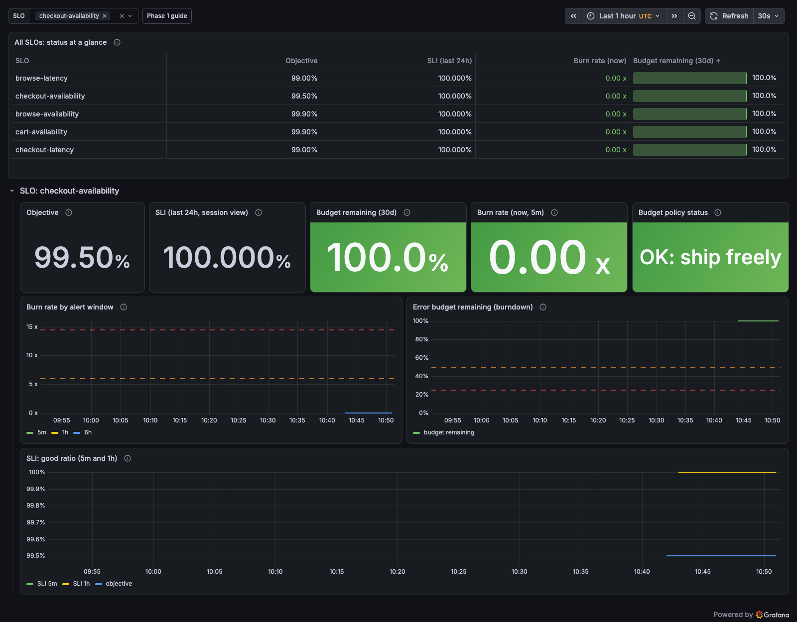
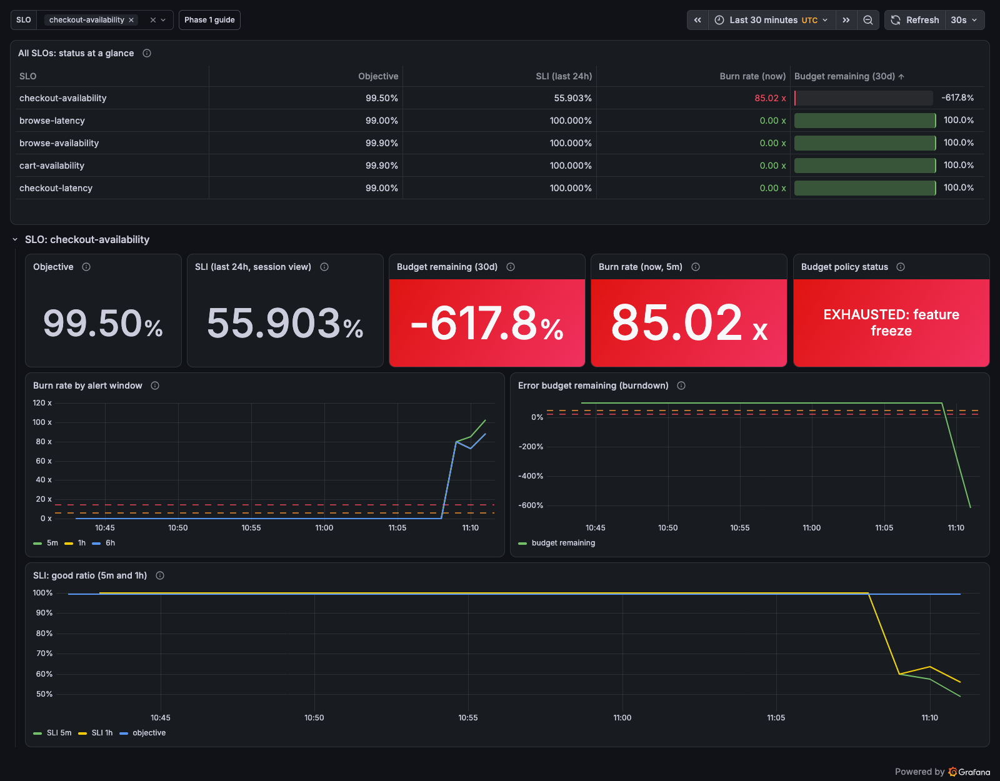

# Phase 1: SLIs, SLOs and Error Budgets (Execution Guide)

> **Goal:** SLOs for the shop's critical user journeys, written as code; burn-rate alerts;
> an error-budget dashboard; and **proof that it all works**, by injecting a real failure.
> **Principles practiced:** [01 SLI/SLO/SLA](../principles/01-sli-slo-sla.md), [02 Error budgets](../principles/02-error-budgets.md), [03 Alerting](../principles/03-monitoring-alerting.md).
> **Prerequisite:** Phase 0 done, the cluster running, and `make open` running in a terminal.
> **Executed:** 2026-09-25, chart 0.42.0 (Helm revisions 2 → 5).

**Most important lesson of this phase:** the first version of our checkout SLI **could not see a
50% checkout outage**. We only found out because we tested the SLI with an injected failure.
Always test an SLI before trusting it (see [§7](#7-the-experiment-inject-a-failure-and-watch-the-budget-burn)).

---

## 0. What gets built

```
slos/*.yaml (Sloth specs, the source of truth)
   │  make slo-rules  →  sloth generate  →  promtool check rules
   ▼
observability/prometheus/rules/*.yaml   (generated; 85 rules: 75 recording + 10 alerts)
   │  packaged by scripts/gen-slo-rules.sh
   ▼
apps/astronomy-shop/values-slo-rules.yaml  →  make deploy  →  Prometheus ConfigMap
   │                                                       (reloaded live by a sidecar)
   ▼
slo:* recording rules  ──►  Grafana "SRE Lab / SLO & Error Budgets" (make dashboards)
                       └─►  burn-rate alerts (page / ticket), routed to people in Phase 3
```

| File | Purpose |
|---|---|
| [slos/checkout.yaml](../../slos/checkout.yaml), [browse.yaml](../../slos/browse.yaml), [cart.yaml](../../slos/cart.yaml) | SLO specs (Sloth format) |
| [scripts/gen-slo-rules.sh](../../scripts/gen-slo-rules.sh) | Spec → rules → validate → Helm values (needs only Docker) |
| [apps/astronomy-shop/values.yaml](../../apps/astronomy-shop/values.yaml) | Prometheus reload, Grafana memory, collector status dimensions |
| [observability/dashboards/slo-overview.json](../../observability/dashboards/slo-overview.json) | Error-budget dashboard as code |
| [scripts/flag.sh](../../scripts/flag.sh) | Scriptable fault injection (flagd) |
| [Makefile](../../Makefile) | `slo-rules`, `dashboards`, `prom` targets |

---

## 1. Explore the telemetry before designing SLIs

SLIs come from the telemetry that actually exists, not from assumptions.

```bash
make prom      # second terminal: Prometheus at http://localhost:9090
P=http://localhost:9090/api/v1
q(){ curl -s -G "$P/query" --data-urlencode "query=$1" | python3 -m json.tool; }

# Which frontend routes get traffic?
q 'topk(15, sum by (span_name) (rate(traces_span_metrics_calls_total{service_name="frontend",span_kind="SPAN_KIND_SERVER"}[10m])))'
# What does the edge proxy (Envoy) record?
q 'sum by (span_name, span_kind) (rate(traces_span_metrics_calls_total{service_name="frontend-proxy"}[10m]))'
# Which latency buckets exist? (thresholds MUST sit on a bucket boundary)
q 'count by (le) (traces_span_metrics_duration_milliseconds_bucket{service_name="checkout",span_name="oteldemo.CheckoutService/PlaceOrder"})'
```

**What we found:**
- **Envoy (frontend-proxy) server spans have no route**, just `GET` / `POST` → per-journey SLIs have to use the **frontend server spans** (`POST /api/checkout`, `GET /api/products/...`, `POST /api/cart`). That's the first application hop after the edge. ([P1-ISSUE-1](#issues-log))
- **Histogram buckets (ms):** `2, 4, 6, 8, 10, 50, 100, 200, 400, 800, 1000, 1400, 2000, 5000, 10000, 15000, +Inf`. There's no 300 ms bucket, so browse latency uses **400 ms**. ([P1-ISSUE-2](#issues-log))
- The frontend emits **two server spans per request** (the old and new HTTP conventions): the `POST /api/checkout` rate is exactly **2.0×** checkout's `PlaceOrder`. ([P1-ISSUE-3](#issues-log))

---

## 2. Baseline the candidate SLIs

```bash
F='service_name="frontend",span_kind="SPAN_KIND_SERVER"'
C="$F,span_name=\"POST /api/checkout\""
# availability over the window
q "sum(increase(traces_span_metrics_calls_total{$C,status_code!=\"STATUS_CODE_ERROR\"}[1h])) / sum(increase(traces_span_metrics_calls_total{$C}[1h]))"
# share of requests faster than a threshold
q "sum(increase(traces_span_metrics_duration_milliseconds_bucket{$C,le=\"1000\"}[1h])) / sum(increase(traces_span_metrics_duration_milliseconds_count{$C}[1h]))"
# p99 for context
q "histogram_quantile(0.99, sum by (le) (rate(traces_span_metrics_duration_milliseconds_bucket{$C}[1h])))"
```

| Journey | Availability | Latency (< threshold) | p99 | Volume |
|---|---|---|---|---|
| Checkout | 98.33%* | 100% < 1000 ms | 557 ms | ~2 checkouts/min |
| Browse (product APIs) | 100% | 100% < 400 ms | 49 ms | ~16/min |
| Add to cart | 100% | 100% | — | ~5/min |

\* This was **not** an ongoing problem. The cluster had only been up 27 minutes, so the "1h" and "30m"
windows both covered the Phase 0 start-up failure (ISSUE-6 in Phase 0). The raw counter showed **1 failed
checkout out of 62**, all during start-up. Watch out for PromQL escaping as well: `\[productId\]` inside
a regex breaks the query, so use `GET /api/products.*`. ([P1-ISSUE-4](#issues-log))

> **Baselines are provisional.** 27 minutes isn't a baseline. Re-baseline after a cluster has been running for at least 24h
> (ideally a week) and adjust the objectives in `slos/*.yaml`.

---

## 3. Write the SLOs as code (Sloth)

| SLO | SLI: good event | Objective (30d) | Budget |
|---|---|---|---|
| `checkout-availability` | `POST /api/checkout` **not 5xx and not 422** | **99.5%** | 3h 36m |
| `checkout-latency` | `POST /api/checkout` < **1000 ms** | **99%** | 7h 12m |
| `browse-availability` | `GET /api/products.*` not 5xx | **99.9%** | 43m |
| `browse-latency` | `GET /api/products.*` < **400 ms** | **99%** | 7h 12m |
| `cart-availability` | `POST /api/cart` not 5xx | **99.9%** | 43m |

The final checkout availability SLI (see [§7](#7-the-experiment-inject-a-failure-and-watch-the-budget-burn) for why it looks like this):
```yaml
error_query: >-
  (sum(rate(traces_span_metrics_calls_total{service_name="frontend",span_kind="SPAN_KIND_SERVER",
  span_name="POST /api/checkout",
  http_response_status_code=~"5..|422"}[{{.window}}])) or vector(0))
total_query: >-
  sum(rate(traces_span_metrics_calls_total{service_name="frontend",span_kind="SPAN_KIND_SERVER",
  span_name="POST /api/checkout",http_response_status_code!=""}[{{.window}}]))
```
Three rules are built into every SLI:
1. **`http_response_status_code!=""`** selects one of the frontend's two spans, so **each request is counted once**.
2. **Failures are classified by HTTP status**, not by span status (P1-ISSUE-11).
3. **`or vector(0)`**: when there are zero errors, the error series doesn't exist, and without this the SLI would be *empty* rather than 0 (P1-ISSUE-5).

Latency SLIs use `count − bucket{le="…"}` as the error query.

---

## 4. Generate, validate and deploy the rules

```bash
make slo-rules     # = scripts/gen-slo-rules.sh
```
The script uses Docker only (nothing to install):
```bash
docker run --rm -v "$PWD:/w" -w /w ghcr.io/slok/sloth:v0.16.0 generate -i slos -o observability/prometheus/rules --no-log
docker run --rm -v "$PWD/observability/prometheus/rules:/r" --entrypoint promtool prom/prometheus:v3.14.0 check rules /r/*.yaml
# then it packages all groups into apps/astronomy-shop/values-slo-rules.yaml
```
Expected output: `SUCCESS: 34 / 34 / 17 rules found` → `15 rule groups, 85 rules`.

**Prometheus changes** (in `values.yaml`, needed once):
```yaml
prometheus:
  configmapReload:
    prometheus:
      enabled: true              # sidecar that calls /-/reload when rules change
  server:
    extraFlags:                  # Helm REPLACES lists: repeat the chart defaults
      - "enable-feature=exemplar-storage"
      - "web.enable-otlp-receiver"
      - "web.enable-lifecycle"   # required for /-/reload
```
```bash
make deploy        # now also passes -f apps/astronomy-shop/values-slo-rules.yaml
```

**Verify:**
```bash
curl -s $P/rules | python3 -c "import json,sys;g=json.load(sys.stdin)['data']['groups'];print(len(g),'groups', sum(r['type']=='alerting' for x in g for r in x['rules']),'alerts', [r['name'] for x in g for r in x['rules'] if r.get('health')=='err'])"
# 15 groups 10 alerts []
q 'slo:sli_error:ratio_rate5m'                       # 5 series, one per SLO
q 'slo:period_error_budget_remaining:ratio'         # 1 = 100% budget left
```
Rules show `health: unknown` for about 2 minutes after a Prometheus restart, until `rate()` has 2 samples (P1-ISSUE-6).

**Later rule changes reload live:** `make slo-rules && make deploy`. The Prometheus pod is **not** restarted (we confirmed it: same pod, 0 restarts).

---

## 5. The error-budget dashboard

```bash
make dashboards    # ConfigMap "sre-lab-dashboards" with label grafana_dashboard=1 → Grafana sidecar loads it
```
Open **http://localhost:8080/grafana/d/sre-lab-slo-overview**.

| Panel | What it shows | Status rule |
|---|---|---|
| All SLOs table | Objective, SLI (24h), burn rate, budget remaining | Budget gauge: >50% green · 25–50% amber · <25% red ([budget policy](../sre-way.md#2-error-budget-policy)) |
| Budget remaining (30d) | `slo:period_error_budget_remaining:ratio` | Same thresholds |
| Burn rate (now) | `slo:current_burn_rate:ratio` | ≥1x amber, ≥6x red |
| Budget policy status | The **text** form of the policy tier (never colour alone) | OK / CAUTION / AT RISK / EXHAUSTED |
| Burn rate by window | 5m / 1h / 6h burn, with dashed lines at the **14.4x** and **6x** page thresholds | — |
| Burndown | Budget remaining over time | — |
| SLI good ratio | 5m & 1h SLI against the objective line | — |

Healthy baseline: 

---

## 6. Scriptable fault injection

```bash
scripts/flag.sh list                       # 18 flags and their current variant
scripts/flag.sh get paymentFailure         # variants: off, 10%, 25%, 50%, 75%, 90%, 100%
scripts/flag.sh set paymentFailure 50%     # prints a UTC timestamp, which goes in the incident timeline
scripts/flag.sh reset                      # everything back to off
```
It works through the flagd-ui API (`/feature/api/read-file`, `/feature/api/write-to-file`).
**The flags live in an emptyDir copy**, so restarting the flagd pod resets them to the chart defaults.

**The real flag names in demo 3.1.0** (our earlier docs had guessed some wrong; they've been corrected):
`adFailure, adHighCpu, adManualGc, cartFailure, emailMemoryLeak, failedReadinessProbe, imageSlowLoad,
intlShippingSlowdown, kafkaQueueProblems, loadGeneratorFloodHomepage, paymentFailure, paymentUnreachable,
productCatalogFailure, productCatalogLockContention, recommendationCacheFailure` (+ `aiRunawayAgent`,
`aiSlowResponse`, `emitRawPii`).

---

## 7. The experiment: inject a failure and watch the budget burn

**Hypothesis, written before starting:** `paymentFailure` at 50% → ~50% of checkouts fail → burn ≈ 0.5 / 0.005 = **~100x**
→ the `CheckoutAvailabilityBudgetBurn` **page** alert fires within minutes. Browse and cart stay flat.

Observation loop (used for both runs):
```bash
v(){ curl -s -G "$P/query" --data-urlencode "query=$1" | python3 -c "import json,sys;r=json.load(sys.stdin)['data']['result'];print(','.join(f\"{float(x['value'][1]):.3f}\" for x in r) or '-')"; }
while true; do
  echo "$(date -u +%T) err5m=$(v 'slo:sli_error:ratio_rate5m{sloth_id="checkout-availability"}') \
burn=$(v 'slo:current_burn_rate:ratio{sloth_id="checkout-availability"}')x \
budget=$(v 'slo:period_error_budget_remaining:ratio{sloth_id="checkout-availability"}') \
alerts=$(curl -s $P/alerts | python3 -c "import json,sys;print(sorted({a['labels']['alertname']+'/'+a['labels']['severity']+'='+a['state'] for a in json.load(sys.stdin)['data']['alerts']}))")"
  sleep 30; done
```

### Run 1: the hypothesis was disproved (10:52–11:03 UTC)
After **9 minutes** at 50%: `err5m=0.000`, burn 0x, **no alert**. But:
```bash
q 'sum by (status_code) (increase(traces_span_metrics_calls_total{service_name="payment",span_kind="SPAN_KIND_SERVER"}[10m]))'
# payment: 16.5 ERROR vs 15.6 OK → the flag WAS working
```
A failing trace showed the reason:
```
frontend-proxy  POST                      http.status_code=422
frontend        POST /api/checkout        http.response.status_code=422   (span status UNSET!)
frontend        executing api route       otel.status_code=ERROR
checkout        PlaceOrder                ERROR "failed to charge card ... Invalid token"
payment         Charge                    ERROR
```
**Root cause (P1-ISSUE-11):** the frontend answers a failed checkout with **HTTP 422**. OpenTelemetry marks
HTTP *server* spans as ERROR **only for 5xx** (a 4xx is treated as the client's fault), so our SLI
(`status_code="STATUS_CODE_ERROR"` on the server span) counted every failed order as a success.
**Fix:** added `http.response.status_code` and `http.status_code` as span-metric dimensions (collector
config), and redefined the SLIs to use status codes: checkout is bad if `5..|422`.
Follow-up for the app team: a payment backend failure is a server-side error and should return 5xx, not 422.

### Run 2: the hypothesis confirmed (11:06–11:25 UTC)

| Time (UTC) | Event |
|---|---|
| 11:06:33 | `scripts/flag.sh set paymentFailure 50%` |
| 11:09:07 | SLI shows errors (err5m = 40%). **Detection lag ≈ 2.5 min** (P1-ISSUE-13) |
| 11:10:40 | **`CheckoutAvailabilityBudgetBurn` severity=page FIRING** (and ticket). **Time to detect ≈ 4 min** |
| 11:10–11:13 | Burn **80–116x** (the prediction was ~100x); budget shows **−264% → −618%** (P1-ISSUE-12) |
| 11:10–11:25 | browse and cart SLIs stay at 0% errors, so the blast radius was only checkout ✓ |
| 11:11:47 | Mitigation: `scripts/flag.sh reset` |
| 11:14:50 | err5m back to 0 (the 5m window lags by up to 5 minutes) |
| 11:17:28–11:22:36 | **A telemetry gap:** no frontend metrics, so SLIs and dashboards went blank (P1-ISSUE-16) |
| 11:24:35 | SLIs back; 30m error ratio still 23%, so **the page keeps firing** (P1-ISSUE-14) |

During the incident: 

**What the numbers mean:**
- **Burn 80–116x** at 44–58% errors: burn = error rate / (1 − 0.995). The math in [principles/02](../principles/02-error-budgets.md) holds.
- **The page fired about 1.5 minutes after the SLI moved.** Both the 5m and 1h windows went past 7.2% errors (14.4 × 0.5%).
- **Budget −618% is an artifact of short history**, not a real 30-day figure. Prometheus had only ~30 minutes of data, so "30-day" means "since start-up". Over a real 30-day window, ~8 minutes at ~90x would use ~1.7% of the budget.

---

## Phase 1 exit checklist

- [x] 5 SLOs across 3 critical user journeys, as code in `slos/`
- [x] Rules generated and validated (`promtool`), deployed, and reloaded live
- [x] Error-budget dashboard as code, checked visually
- [x] SLI **tested with an injected failure**, and a blind spot found and fixed (the 422)
- [x] Page alert fired about 4 minutes after injection; no false alerts on the other journeys
- [x] Every edge case recorded below
- [ ] Re-baseline after the cluster has run ≥ 24h (provisional objectives)

**Interview takeaways:**
1. "How do you know your SLI is right?" → *Inject a failure and check that it shows up. Ours didn't at first, because of 422s and OTel status semantics.*
2. "Why multi-window burn-rate alerts?" → *Show the page firing at 80x within 4 min, and explain why it keeps firing after mitigation.*
3. "What happens when telemetry stops?" → *SLIs go blank, not red, and alerts go silent. That's why you need an `absent()` alert.*

---

## Issues log

| ID | Area | Symptom | Root cause | Fix / decision | Verified by |
|---|---|---|---|---|---|
| P1-ISSUE-1 | SLI design | Envoy spans can't separate journeys | Envoy span names are only `GET`/`POST` (no route) | Measure at the frontend server spans (first app hop) | Per-route series exist for `/api/checkout`, `/api/products.*`, `/api/cart` |
| P1-ISSUE-2 | SLI design | The planned browse threshold of 300 ms has no bucket | spanmetrics default buckets: …200, 400, 800… | Use **400 ms**. Thresholds must sit on bucket boundaries or the SLI is silently wrong | `le="400"` series exists |
| P1-ISSUE-3 | SLI design | Request counts were 2× reality | The frontend emits 2 server spans per request (old + new HTTP conventions) | Filter `http_response_status_code!=""` (only the new-convention span has it) | Ratio frontend:PlaceOrder = 2.0 before, 1 request = 1 event after |
| P1-ISSUE-4 | Baseline | Checkout showed 98.33% "after start-up" | The cluster was 27 min old, so both windows included the start-up errors; also a PromQL regex escaping error on `\[productId\]` | Checked the raw counter (1 failure in 62); objectives marked **provisional**; used `GET /api/products.*` | Error series only incremented at 10:13 |
| P1-ISSUE-5 | SLI math | SLI would be **empty** (not 0) for journeys with zero errors | An error-labelled series doesn't exist until the first error | Wrap every error query in `(... or vector(0))` | All 5 `slo:sli_error:ratio_rate5m` series present at 0 |
| P1-ISSUE-6 | Prometheus | Rule changes needed a restart; the restart wiped history | Bundled Prometheus: config reload off, no `--web.enable-lifecycle`, storage is `emptyDir` | Turned on `configmapReload` + the `web.enable-lifecycle` flag (and repeated the default flags, since Helm replaces lists). The one-time pod recreation lost ~30 min of history. Persistent storage comes in Phase 2 | Rev 5 rule change applied with the same pod, 0 restarts |
| P1-ISSUE-7 | Grafana | Dashboard panels "Error loading plugin"; Envoy `upstream connect error` | **Grafana OOMKilled** (exit 137) at the chart's 300Mi limit while rendering 5 SLO rows × ~8 queries | `grafana.resources`: request 384Mi, limit 768Mi. Sized for real load | Rendered the full dashboard; 0 restarts |
| P1-ISSUE-8 | Tooling | Headless screenshots showed errors or blank pages | `--virtual-time-budget` breaks lazy-loaded JS; captures fired before render; after a Grafana restart the sidecar hadn't re-provisioned dashboards yet | Use puppeteer with `networkidle0` + a delay; wait for `/api/dashboards/uid/...` first. Grafana storage is ephemeral, **so dashboards must be code** | Screenshots in this guide |
| P1-ISSUE-9 | Tooling | `label_values(...)` query failed via the API | `label_values()` is Grafana variable syntax, not PromQL | Nothing to fix (works inside the dashboard variable) | Variable lists all 5 SLOs |
| P1-ISSUE-10 | Fault injection | Flag names in the docs didn't exist; flag changes vanish on restart | Demo 3.1.0 renamed/added flags; the flag file is an emptyDir copy | `scripts/flag.sh`; docs updated to the real names | `flag.sh list` |
| **P1-ISSUE-11** | **SLI correctness** | **A 50% checkout outage was invisible to the SLI** | Frontend returns **422**; OTel only marks 5xx server spans as ERROR | Added HTTP status dimensions to span_metrics; SLIs now use status codes (`5..|422` for checkout). **Ticket for the app team:** return 5xx for backend failures | Run 2: SLI 40–58% errors, page fired |
| P1-ISSUE-12 | Budget math | Budget remaining −264% → −618% after ~8 minutes of failures | The "30d" window only had ~30 min of data; the 3d/6h *ticket* alert fired for the same reason | Expected on a new SLO. Budget figures are meaningful only once the window is full; use the **24h session SLI** on lab clusters | Explained; see the §7 numbers |
| P1-ISSUE-13 | Detection | ~2.5 min from failure to SLI movement; ~4 min to page | Load-generator checkout rate (~2/min) + collector flush (~60s) + 1m scrape/eval + `rate()` needing 2 samples | Accepted for the lab. In production, more traffic means faster detection. Record time to detect in every game day | Timeline in §7 |
| P1-ISSUE-14 | Alerting | The page stays **firing** after mitigation (err5m=0) | The page alert has two conditions; the **30m & 6h** pair (> 6 × 0.5% = 3%) stays true until the 30m window no longer holds the failures (~30 min) | By design (it stops pages flapping). Phase 3: Alertmanager sends "resolved"; the runbook explains this | 11:24: 30m error ratio 23% > 3% |
| P1-ISSUE-15 | Load generator | Locust showed 8.6% failures; `POST /prompt` 296/296 failed | The load generator still calls the chatbot we turned off (Phase 0 ISSUE-3) | Not in any SLI, so SLOs are unaffected. Optional: turn off the chatbot user task in Locust | Locust `/loadgen/stats/requests` |
| **P1-ISSUE-16** | **Telemetry** | Frontend span metrics stopped **11:17:28–11:22:36**; SLIs and dashboards went **blank**; Locust saw some 503s | **Root cause (found in Phase 3, P2-ISSUE-19): the Mac went to idle sleep 06:17:16–06:21:42 local = 11:17–11:21 UTC**, which froze the whole Docker VM. (Phase 2 first blamed memory thrashing; that attribution was **wrong** and has been corrected.) At the time: no pod restarts, 0 exporter failures, which is the signature of the whole VM pausing | **Lesson:** when telemetry stops, SLIs go blank rather than red, and alerts can't fire. **Phase 2:** collector self-monitoring + proxy metrics to find the cause. **Phase 3:** add `absent(slo:sli_error:ratio_rate5m)` "SLI data missing" alert | Data resumed on its own at 11:22:36 |
| P1-ISSUE-17 | Collector noise | Repeated collector errors in logs | `kubeletstats`: kind's kubelet cert has no IP SANs; OpenSearch mapping conflict for `http.*` attributes | Doesn't affect SLOs. **Phase 2:** `insecure_skip_verify` for kind's kubelet, and OpenSearch replaced by Loki | `otelcol_exporter_send_failed_metric_points` = 0 for Prometheus |
| P1-ISSUE-18 | Alerting | Alert `runbook` annotations point to the incident-plan index | Runbooks are written in Phase 3 | Temporary link; Phase 3 replaces it with `runbooks/<alert>.md` | — |

---

## Re-run Phase 1 from scratch

```bash
make cluster-up && make deploy     # (Phase 0) now includes the SLO rules and all fixes above
make open                           # terminal 1
make prom                           # terminal 2
make dashboards
# wait ~3 min for the SLIs, then:
scripts/flag.sh set paymentFailure 50%   # watch the dashboard; page fires within ~4-5 min
scripts/flag.sh reset
```
