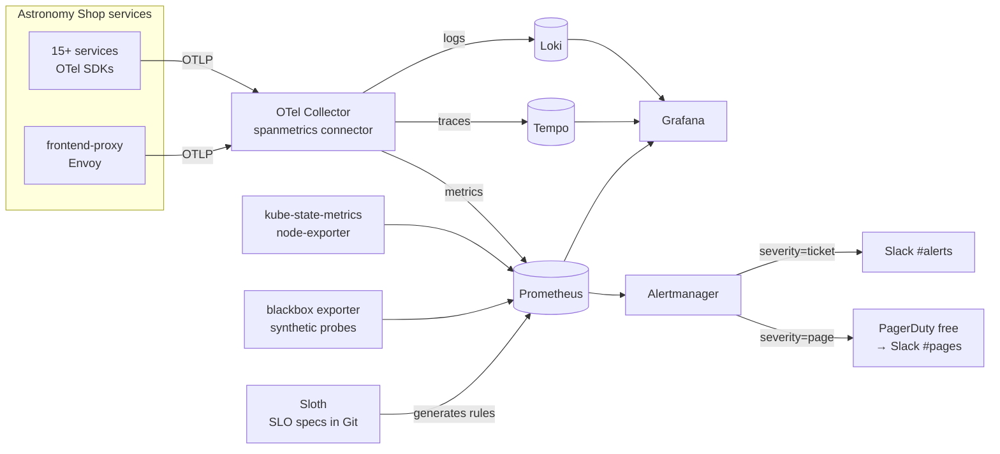

# Observability Plan: SLIs → SLOs → Error Budgets → Alerts

This is the concrete plan for measuring the SLOs from [principles/01](principles/01-sli-slo-sla.md),
tracking their error budgets ([principles/02](principles/02-error-budgets.md)), and alerting on them
([principles/03](principles/03-monitoring-alerting.md)). It's built in Phases 1–3.

## 1. Target stack



| Layer | Tool | Why this one |
|---|---|---|
| Instrumentation | OpenTelemetry (already in the app) | Vendor-neutral, the industry standard |
| Pipeline | OTel Collector (bundled with the demo) | Turns traces into RED metrics with spanmetrics |
| Metrics | Prometheus, via **kube-prometheus-stack** | The standard on Kubernetes. Includes Alertmanager, Grafana, node-exporter, kube-state-metrics |
| Traces | **Tempo** (replacing the bundled Jaeger) | Links from Grafana exemplars; cheap object storage |
| Logs | **Loki** (replacing the bundled OpenSearch) | Light on resources; accepts OTLP natively; `trace_id` links to Tempo |
| SLOs as code | **Sloth** | Generates SLI recording rules and multi-window burn-rate alerts from a short YAML spec |
| Synthetic checks | blackbox exporter | Catches total outages even when there's no traffic |

Phase 0–1 uses the bundled stack. Phase 2 moves to the stack above (write an ADR for the change).

## 2. SLI catalogue

| ID | CUJ | SLI | Good event | Source | SLO (30d) |
|---|---|---|---|---|---|
| SLI-1 | Checkout | Availability | `PlaceOrder` span not `STATUS_CODE_ERROR` | spanmetrics (`checkout`) | **99.5%** |
| SLI-2 | Checkout | Latency | `PlaceOrder` < 1000 ms | spanmetrics histogram | **99%** |
| SLI-3 | Browse | Availability | Product API response not 5xx | Envoy (`frontend-proxy`) | **99.9%** |
| SLI-4 | Browse | Latency | Product API < 300 ms | Envoy histogram | **99%** |
| SLI-5 | Add to cart | Availability | `AddItem` not an error | spanmetrics (`cart`) | **99.9%** |
| SLI-6 | Order processing (async) | Freshness | Kafka consumer lag for `accounting` < 60s | Kafka exporter | **99%** of minutes |
| SLI-7 | Whole shop | Synthetic availability | Homepage probe succeeds | blackbox exporter | **99.9%** |

Load-generator traffic **counts as user traffic** in this lab, because it's our only user population.

## 3. SLOs as code (Sloth)

The specs live in `slos/<service>.yaml`, and CI generates Prometheus rules from them. Example for SLI-1:

```yaml
version: "prometheus/v1"
service: "checkout"
labels:
  owner: "sre-lab"
  cuj: "checkout"
slos:
  - name: "place-order-availability"
    objective: 99.5
    description: "Checkout PlaceOrder requests succeed."
    sli:
      events:
        error_query: >
          sum(rate(traces_span_metrics_calls_total{service_name="checkout",
            span_name="oteldemo.CheckoutService/PlaceOrder",
            status_code="STATUS_CODE_ERROR"}[{{.window}}]))
        total_query: >
          sum(rate(traces_span_metrics_calls_total{service_name="checkout",
            span_name="oteldemo.CheckoutService/PlaceOrder"}[{{.window}}]))
    alerting:
      name: CheckoutAvailability
      annotations:
        runbook: "https://github.com/sandeshlamsal/SRE_BestPractices_Principles_Interviews_Labs/blob/main/runbooks/checkout-availability.md"
      page_alert:
        labels: { severity: page }
      ticket_alert:
        labels: { severity: ticket }
```

Sloth generates:
- `slo:sli_error:ratio_rate{5m,30m,1h,2h,6h,1d,3d,30d}` recording rules
- `slo:error_budget:ratio` and `slo:objective:ratio`, used by the budget dashboards
- Page alerts (14.4x over 1h/5m and 6x over 6h/30m) and ticket alerts (3x over 1d/2h and 1x over 3d/6h)

Metric names must be checked against the running Prometheus before this spec is committed.

## 4. Error budget tracking

### Dashboards

| Dashboard | Audience | Panels |
|---|---|---|
| **SLO overview** | Everyone, first screen during an incident | Per SLO: current SLI (30d), target, **budget remaining %**, current burn rate, and a status colour (green > 50%, amber 25–50%, red < 25%) |
| **SLO detail** (per SLO) | On-call | Budget burndown over 30d, burn rate by alert window, SLI over time, **annotations for deploys, flag changes, and incidents** |
| **Service RED** | Debugging | Rate, errors, p50/p95/p99 per service, with exemplars linking to traces |
| **Kafka / async** | Debugging | Consumer lag, throughput per topic |
| **Cluster USE** | Debugging, capacity | Node and pod CPU, memory, throttling, OOM kills, restarts |

Sloth's published Grafana dashboards are a good starting point. Import them and adjust.

### Budget reporting routine

| Cadence | What happens | Output |
|---|---|---|
| Every incident | Record the budget consumed in the postmortem | `postmortems/*.md` |
| Weekly (15 min) | **SLO review**: budget status per SLO, top burners, noisy alerts, status of the budget policy | `docs/slo-reports/YYYY-Www.md` |
| Monthly | Are the SLO targets right? Tighten, loosen, or add or remove SLOs | A PR to `slos/`, with reasoning |

### Local SLO windows
A laptop cluster isn't up for 30 days in a row. Here's how that plays out:
- **Burn-rate alerts work as soon as the cluster starts**, because they use 5m–6h windows.
- 30-day budget panels only cover the time Prometheus has data for. Add a **"session budget"** panel (the same SLI over the last 24h) for game days.
- The long-window SLO numbers become meaningful in the cloud phase, or if you leave the cluster running for a week.

## 5. Alert routing

```yaml
# Alertmanager routing (sketch)
route:
  receiver: ticket
  group_by: [alertname, service]
  routes:
    - matchers: [severity="page"]
      receiver: pager
      group_wait: 30s
      repeat_interval: 1h
    - matchers: [severity="ticket"]
      receiver: ticket
      repeat_interval: 12h
inhibit_rules:
  - source_matchers: [alertname="ShopDown"]   # the synthetic probe failing
    target_matchers: [severity="page"]
    equal: [cluster]
```

| Receiver | Local lab | Real-world equivalent |
|---|---|---|
| `pager` | PagerDuty free plan (Events API v2), mirrored to Slack `#pages` ([ADR-0003](adr/0003-paging-and-incident-tooling.md)) | PagerDuty / incident.io |
| `ticket` | Slack `#alerts` (incoming webhook) | Jira / Linear |

**Rule:** no alert is merged without a `runbook` annotation that points to a file that exists.

## 6. Build checklist
- [ ] **Phase 1:** check the metric names; baseline SLI-1…5 for a week; write the specs in `slos/`; import the SLO dashboards
- [ ] **Phase 2:** kube-prometheus-stack + Tempo + Loki; point the demo collector at them; disable the bundled Jaeger/OpenSearch/Prometheus; turn on exemplars; add links from traces to logs
- [ ] **Phase 2:** RED, Kafka, and USE dashboards committed as JSON under `observability/dashboards/`
- [ ] **Phase 3:** Sloth rules deployed; Alertmanager routes; runbooks for every page alert; blackbox probe; deploy and flag annotations
- [ ] **Phase 3:** test every page alert by turning on the matching flag. An alert that has never fired is unverified
